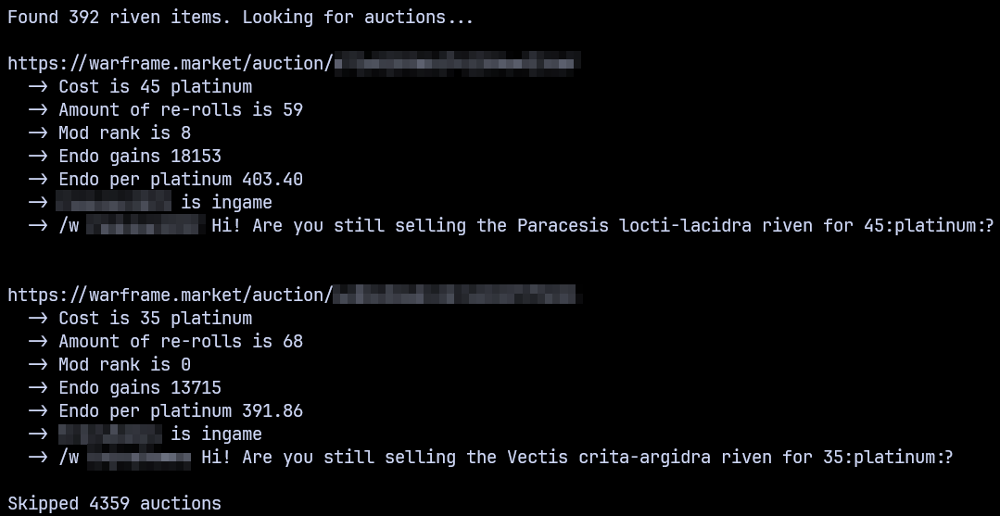

# Warframe Market Endo Rivens

Uses the warframe.market API to fetch riven mod listings with desired endo gains per platinum cost.

You can enable silent mode, which will make the program only print the wanted auctions.

## Usage

```
Usage of endo-rivens:
  -minEndo int
        Minimum endo gains per platinum cost (default 300)
  -minPrice int
        Minimum platinum price (default 10)
  -silent
        Silent mode
  -sort
        Sort output
```

## Example output

### Normal Mode



### Silent Mode


